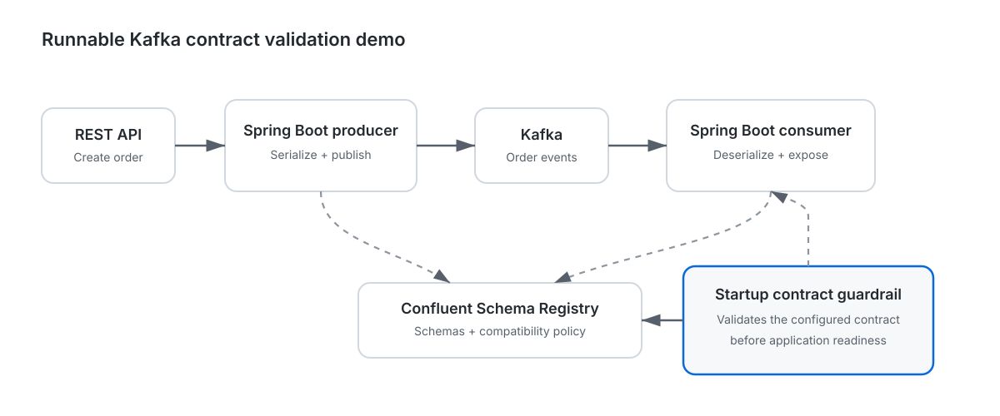

This repository is part of the **Kafka Contract Enforcement** initiative:
- 🔧 Starter: https://github.com/mathias82/spring-kafka-contract-starter
- 🌐 Live Demo: https://mathias82.github.io/spring-kafka-contract-demo/

# 🧪 Spring Kafka Contract Demo

A runnable Spring Boot demo for **fail-fast Kafka Schema Registry contract validation** with Apache Kafka, Avro, and Confluent Schema Registry.

The demo uses the published `spring-kafka-contract-starter` **0.2.4** from Maven Central and proves startup contract enforcement, configurable registry-outage behavior, and a real producer → Kafka → consumer round trip.

## Architecture

<p align="center">
  
</p>

The consumer keeps received events in memory for demo purposes. PostgreSQL is not required.

## Tech stack

- Java 21
- Spring Boot 3.3
- Spring Kafka
- Apache Kafka
- Confluent Schema Registry
- Avro
- Docker Compose
- `spring-kafka-contract-starter` 0.2.4

## Five-minute walkthrough

Run the complete local demonstration with one command:

```bash
bash scripts/run-demo.sh
```

The script starts Kafka and Schema Registry, builds the application, and runs the full contract scenario suite. By default it tears the Docker stack down afterwards. To keep the stack running for manual exploration:

```bash
KEEP_STACK=true bash scripts/run-demo.sh
```

The expected story is intentionally simple:

1. **baseline schema** → application starts and a real producer → Kafka → consumer round trip succeeds
2. **backward-compatible evolution** → application starts
3. **breaking evolution** → application refuses to start
4. **temporary registry outage + WARN** → startup continues with an observable warning
5. **temporary registry outage + FAIL** → startup is rejected

## Run the demo step by step

### 1. Start Kafka and Schema Registry

```bash
docker compose up -d
```

The `schema-init` service waits for Schema Registry, configures `BACKWARD` compatibility, and registers the `order-events-value` v1 subject used by the application.

### 2. Build the demo

```bash
mvn clean package
```

### 3. Run all contract scenarios

```bash
bash scripts/verify-contract-scenarios.sh
```

The verifier exercises five expected behaviors:

1. `order-event-v1.avsc` starts successfully and completes a real producer → Kafka → consumer round trip.
2. `order-event-v2.avsc` starts successfully because it is backward compatible with v1.
3. `order-event-v3.avsc` must fail startup because it is intentionally incompatible.
4. An unreachable registry allows startup when `unavailable-policy` is `WARN`.
5. The same outage fails startup when `unavailable-policy` is `FAIL`.

## Run the baseline application manually

```bash
mvn spring-boot:run
```

Then publish and consume an order:

```bash
curl -X POST http://localhost:8080/api/orders \
  -H 'Content-Type: application/json' \
  -d '{"orderId":"demo-1","amount":42.5,"createdAt":"2026-08-30T00:00:00Z"}'

curl http://localhost:8080/api/orders/events
```

The second call should eventually contain `demo-1`, proving the event was serialized, published to Kafka, consumed, deserialized, and exposed by the demo.

## Contract configuration

```yaml
kafka:
  contract:
    enabled: true
    compatibility: BACKWARD
    registry:
      url: http://localhost:8081
      connect-timeout-ms: 2000
      read-timeout-ms: 5000
      unavailable-policy: FAIL
    subjects:
      - name: order-events-value
        schema-file: classpath:schemas/order-event-v1.avsc
        schema-type: AVRO
```

## Confluent Cloud profile

The repository includes an optional `confluent-cloud` Spring profile so the same application can be pointed at Confluent Cloud without committing credentials.

Set the required environment variables:

```bash
export KAFKA_BOOTSTRAP_SERVERS='...'
export KAFKA_API_KEY='...'
export KAFKA_API_SECRET='...'
export SCHEMA_REGISTRY_URL='...'
export SCHEMA_REGISTRY_API_KEY='...'
export SCHEMA_REGISTRY_API_SECRET='...'
```

Then run:

```bash
mvn spring-boot:run \
  -Dspring-boot.run.profiles=confluent-cloud
```

The profile configures Kafka with `SASL_SSL`/`PLAIN`, configures the Confluent serializer/deserializer with Schema Registry credentials, and passes the same Schema Registry credentials to the startup contract guardrail. You can override the expected subject with `SCHEMA_SUBJECT`.

> The local Docker-based scenario suite remains the reproducible CI proof. The Confluent Cloud profile is an opt-in deployment example and deliberately requires user-provided credentials.

## Schema evolution scenarios

- `order-event-v1.avsc` — baseline runtime contract
- `order-event-v2.avsc` — backward-compatible evolution that adds optional `customerNote` with a default
- `order-event-v3.avsc` — intentionally breaking evolution

Only v1 is compiled into the runtime generated Avro class. v2 and v3 are contract-evolution inputs for startup validation, which avoids duplicate generated classes with the same Avro full name.

You can run a single schema manually by overriding the configured schema file, for example:

```bash
mvn spring-boot:run \
  -Dspring-boot.run.arguments="--kafka.contract.subjects[0].schema-file=classpath:schemas/order-event-v2.avsc"
```

Under `BACKWARD`, v2 should start and v3 should fail fast.

## CI coverage

The GitHub Actions workflow validates the published `spring-kafka-contract-starter` **0.2.4** end to end:

1. verifies that the Maven Central artifact resolves as a normal Maven dependency
2. starts Kafka and Schema Registry
3. waits for schema initialization
4. builds the demo
5. runs the v1 happy path and real Kafka round trip
6. verifies that compatible v2 is accepted
7. verifies that breaking v3 is rejected during startup
8. verifies both `WARN` and `FAIL` behavior when Schema Registry is unreachable

This means CI validates both the real Kafka runtime path and the fail-fast contract behavior users are expected to rely on, using the same published artifact consumers can add to their applications.

## Why this demo exists

Schema compatibility can be checked in developer and CI workflows, but deployment environments can still drift from those assumptions. This demo focuses on that operational boundary: **what happens when the application starts against the registry it is actually configured to use?**

The starter is therefore complementary to build-time Schema Registry tooling rather than a replacement for it.

## Purpose

This repository is a reference application, not a library. Its goal is to make Kafka schema contract failures visible, reproducible, and testable before deployment.
